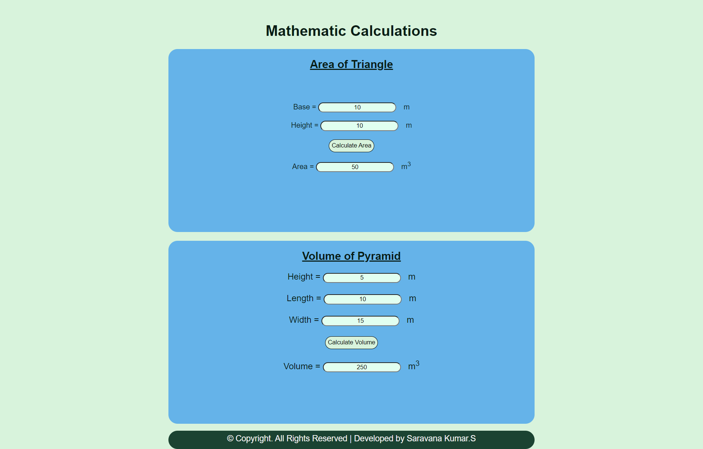

# AngularCalculation

# Web Page for Mathematical Calculations using Angular

## AIM:
To design a dynamic website to perform mathematical calculations using Angular Framwork

## DESIGN STEPS:

### Step 1:

Requirement collection.

### Step 2:

Creating the layout using HTML and CSS in component.html file

### Step 3:

Write typescript to perform the calculations.

### Step 4:

Validate the layout in various browsers.

### Step 5:

Validate the HTML code.

### Step 6:

Publish the website in the given URL.

## PROGRAM :
### app.component.html:
```
<body>
    <div class="container">
    <h1>Math Calculation</h1>
    <div class="content">
        <h2 class="padding"><u>Area of Triangle</u></h2>
        <Triangle-Area class="forms, padding" ></Triangle-Area>
    </div>
    <div class="content1">
        <h2><u>Volume of Pyramid</u></h2>
        <Pyramid-Volume class="forms"></Pyramid-Volume>
    </div>
    <div class="footer">
      &copy; Copyright. All Rights Reserved | Developed by Shafeeq Ahamed.S
    </div>
    </div>
  
  </body>
  ```
  ### style.css:
  ```
  *{
    box-sizing: border-box;
    font-family: Arial, Helvetica, sans-serif;
    }
    
    body{
        background-color: #d8f3dc;
        color: #081c15;
    }
    
    .container{
        text-align: center;
        width: 1080px;
        height: 850px;
        margin-left: auto;
        margin-right: auto;
        margin-top: auto;
    }
    
    .content{
        display: block;
        width: 100%;
        margin-left: auto;
        margin-right: auto;
        background-color: #65b3e9;
        height: 400px;
        width: 800px;
        text-align: center;
        border-radius: 20px;
    }
    
    .padding{
        padding-bottom: 50px;
    }
    .content1{
        display: block;
        width: 100%;
        margin-left: auto;
        margin-right: auto;
        background-color: #65b3e9;
        margin-top: 15px;
        height: 400px;
        width: 800px;
        border-radius: 20px;
    }
    
    h1{
        color: #081c15;
        text-align: center;
        padding-top: 20px;
    }
    
    h2{
        color: #081c15;
        text-align: center;
        padding-top: 20px;
    }
    a{
        padding-left: 1pc;
    }
    input{
        border-radius: 20px;
        text-align: center;
        background-color: #e1fff0;
    }

    .forms{
        text-align: center;
        padding-top: 20px;
        font-size: larger;
    }
    
    .button{
        background-color: #d8f3dc;
        border: 1px solid;
        padding: 5px;
    }
    
    
    .footer{
        color: whitesmoke;
        margin-top: 15px;
        display: inline-block;
        height: 40px;
        width: 800px;
        background-color: #1b4332; 
        text-align: center;
        padding-top: 7px;
        font-size: large;
        border-radius: 20px;
    }
```
### triangle.component.html:
```
<div>
    Base = <input type="text" [(ngModel)]= "base"><a>m</a><br/>
    <br/>
    Height = <input type="text" [(ngModel)]= "height"><a>m</a><br/>
    <br/>
    <input class="button" type = "button" (click)=" onCalculateArea()" value="Calculate Area"><br/>
    <br/>
    Area = <input type="text" readonly value="0" [value]= "area"><a>m<sup>3</sup></a>
</div>
```
### triangle.component.ts:
```
import { Component } from "@angular/core";

@Component({
    selector:"Triangle-Area",
    templateUrl:"./triangle.component.html"
})
export class TriangleComponent{
    base: number;
    height: number;
    area: number;
    constructor(){
        this.base = 10
        this.height = 10
        this.area = (this.base*this.height)/2
    }
    onCalculateArea(){
        this.area = (this.base*this.height)/2
    }
}
```
### pyramid.component.html:
```
<div>
    Height = <input type="text" [(ngModel)]="height"><a>m</a><br/>
    <br/>
    Length = <input type="text" [(ngModel)]="length"><a>m</a><br/>
    <br/>
    Width = <input type="text" step='0.01' [(ngModel)]="width"><a>m</a><br/>
    <br/>
    <input class="button" type="button" value="Calculate Volume" (click)="onCalculateVolume()"><br/>
    <br/>
    Volume = <input type="text"  [value]="volume"><a>m<sup>3</sup></a>
</div>
```
### pyramid.component.ts:
```
import { Component } from "@angular/core";

@Component({
    selector:"Pyramid-Volume",
    templateUrl:"./pyramid.component.html"
})
export class PyramidComponent{
    height:number;
    length:number;
    width:number;
    volume: number;
    constructor(){
        this.height = 5
        this.length = 10
        this.width = 15
        this.volume = ((this.height * this.length * this.width)/3)
    }
    onCalculateVolume(){
        this.volume = (this.height * this.length * this.width)/3
    }
}
```
## OUTPUT:
### Home Page:


## Result:
A dynamic website to perform mathematical calculations is designed using Angular Framwork